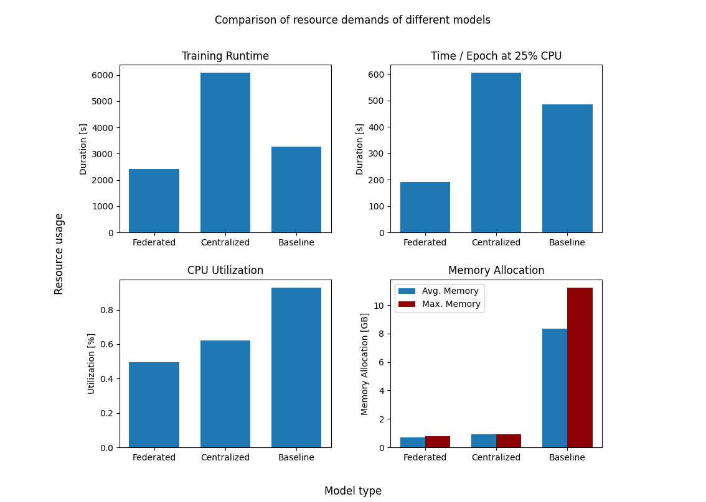
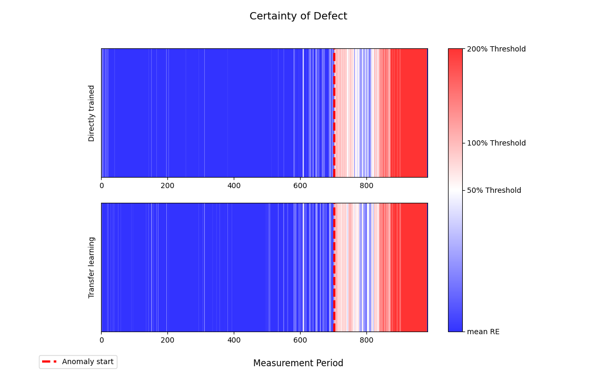

# Federated Learning for Autoencoder-based Anomaly Detection in the Industrial IoT

This repository contains the implementation of a federated learning approach to autoencoder-based condition monitoring, 
focused on an industrial application in the resource-limited domain of the Internet of Things.\

As industrial IoT devices are often resource-limited, they are neither able to perform computational intense model training 
nor to store large amounts of data. 

### Contribution

My work took a stepwise approach to this problem, first optimizing the performance of an 
autoencoder-based anomaly detection model under the given constraints.\
This model was then utilized in a federated learning framework to improve generalizability, 
while gaining data privacy from each individual device by not sharing actual training data.

### Evaluation

To evaluate the success of my research, I conducted a case study on a real-world industrial application of 
anomaly detection in rotating machines, which are commonly found in manufacturing.\
Here, I compared the performance of the federated learning approach to a centralized approach, as well as a baseline model that was resource-unconstrained.

### Results

My research showed, that the proposed model improvements and chosen federated learning approach were able to achieve 
similar performance in the models anomaly detection capabilites, while at the same time strongly improving resource consumption and allowing for data privacy.

# Project Structure

The autoencoder model and relevant functions for training and data preparation (i.e. normalization, batch-sizing..) are implemented in `training.py`.
The federated learning framework is implemented using two different worker scripts `worker_training.py` and `worker_aggregation.py`.
These are containerized by their corresponding dockerfiles in `/build`, producing two docker images that were run on a google compute engine testbed,
for evaluation.

# How To Use

The two models can be executed by their respective file, `training.py`, and `baseline/baseline.py`.
Here, either the resource-optimized model or the comparison baseline can be individually trained
and evaluated.
Relevant training parameters can be specified in the `config.yaml` file.

To run the federated learning approach, the docker images need to be built which can then be deployed to a cloud solution such as GCP.