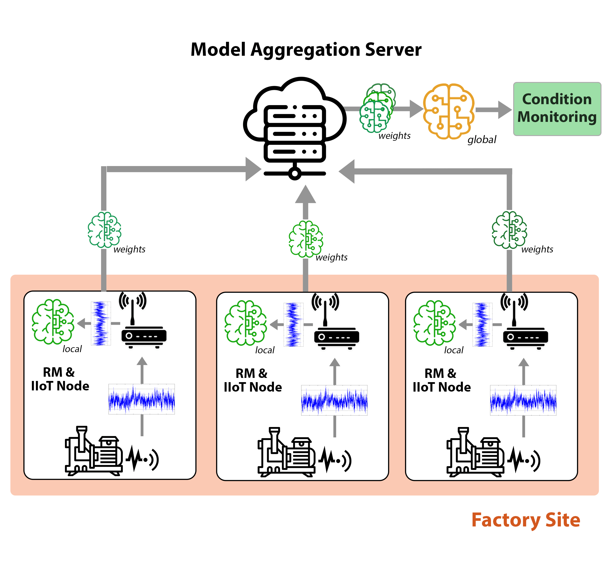

# 🧾 Federated Learning for Autoencoder-based Anomaly Detection in the Industrial IoT

This repository contains the implementation of a federated learning approach to autoencoder-based condition monitoring, 
focused on an industrial application in the resource-limited domain of the Internet of Things.

As industrial IoT devices are often resource-limited, they are neither able to perform computational intense model training 
nor to store large amounts of data. 

## 🔧 Architecture

This work takes a stepwise approach to this problem:
1. Optimizing the performance of an autoencoder-based anomaly detection model under the given constraints.
2. This model was then utilized in a federated learning framework to improve generalizability, while at the same time guaranteeing data privacy for each individual device, by not sharing actual training data but only model weights.

Federated Learning IIoT Use Case Scenario                 | Federated Learning Training Cycle                                             ----------------------------------------------------------|-------------------------------------------------------------------------------
 |  

## 📊 Evaluation & Results

To evaluate the success of this approach, we conducted a case study on a real-world industrial application of 
anomaly detection in rotating machines, which are commonly found in manufacturing.

Here, we compared the performance of the (resource-efficient) federated learning approach to a (resource-efficient) centralized approach, as well as a baseline model that was resource-unconstrained.

Our research showed, that:
1. The proposed resource-efficient model was able to achieve similar anomaly detection performance to the baseline architecture.
2. Even when used in a federated learning framework, only able to share model weights instead of data, instances of the resource-efficient model were still able to achive equal certainty of defect predictions.
3. At the same time, this approach succeeded in strongly improving resource consumption and guaranteeing data privacy, as no trainings data was ever required to leave individual devices.

 

## 🗂️ Project Structure & How to Use

### Models & Training
The resource-efficient autoencoder model and relevant functions for training and data preparation (i.e. normalization, batch-sizing..) are implemented in `src/training.py`.
The baseline model can be executed using `src/baseline.py`.

Here, either the resource-optimized model or the comparison baseline can be individually trained and evaluated.
Finally, the federated learning framework is implemented using two different worker scripts `worker_training.py` and `worker_aggregation.py`.

### Build
Both models as well as the workers of the federated learning framework are containerized by their corresponding dockerfiles in `/build`, creating docker images that can be executed on a google compute engine testbed for evaluation.
To run the federated learning approach, the docker images need to be built which can then be either locally executed or deployed to a cloud solution such as GCP.

### Configuration
All relevant training parameters, such as LR, batch size, or federated clients & connection parameters can be specified in the central `config.yaml` file.

